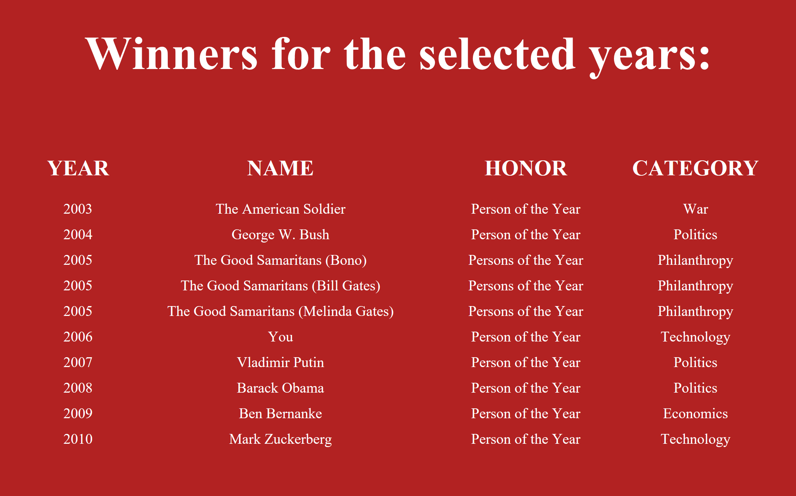

# Lab11-TimePersonOfTheYear
CF401 - Intro to MVC & Core

# What it does
This web application presents filtered data from an external data file based on user-defined search parameters.

## Description
A .csv data file is the single data source for this application. The data file contains a list of winners of Time Magazine's 'Person Of The Year' award (1927-2016), along with biographical details about each winner and the context of the award. The search is by year - the user is prompted to enter a start year and end year to bound the search, and all winners in and between those years are returned with some basic data presented.

# Architecture
This ASP.NET Core MVC application contains a single controller ('Home'), 2 views ('Index' and 'Results'), and 3 actions (2 Get to render/send views, 1 Post to collect user inputs). 
The VIEWS include:
  - Index: Splash page with a form for the user to enter search parameters.
  - Results: Table of search results, including selected properties from each result.
The MODEL consists of a single custom class ('TimePerson') which contains properties for each of the pieces of information found in the external data file, as well as methods to:
  - convert the data file's contents into usable objects held in (iterable) lists, and
  - filter the data based on the user-defined search parameters.
    NOTE: The application doesnt contain a use case for a single entry from the data file, and are intended to build and manipulate individual TimePerson objects, so all methods are static, and most are private.
The CONTROLLER serves (HttpGet) the Index page initially (renders the 'Index' HTML template). On form submit (HttpPost), it redirects to the 'Results' action. The 'Results' action calls on the TimePerson class to dig all the data out of the data file, convert it to useable format, filter it according to the user's specifications, and return a list of objects that pass the filter. It then serves a rendered table of results (HttpGet) using the 'Results' HTML template.

# Visuals

